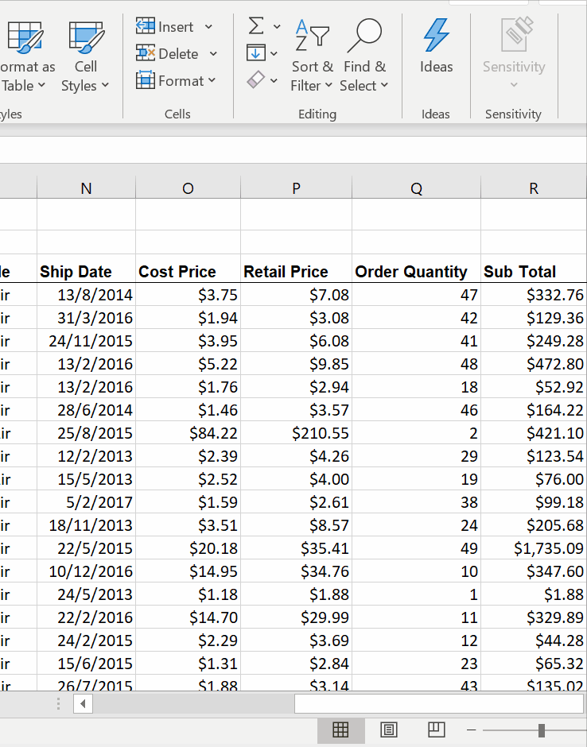
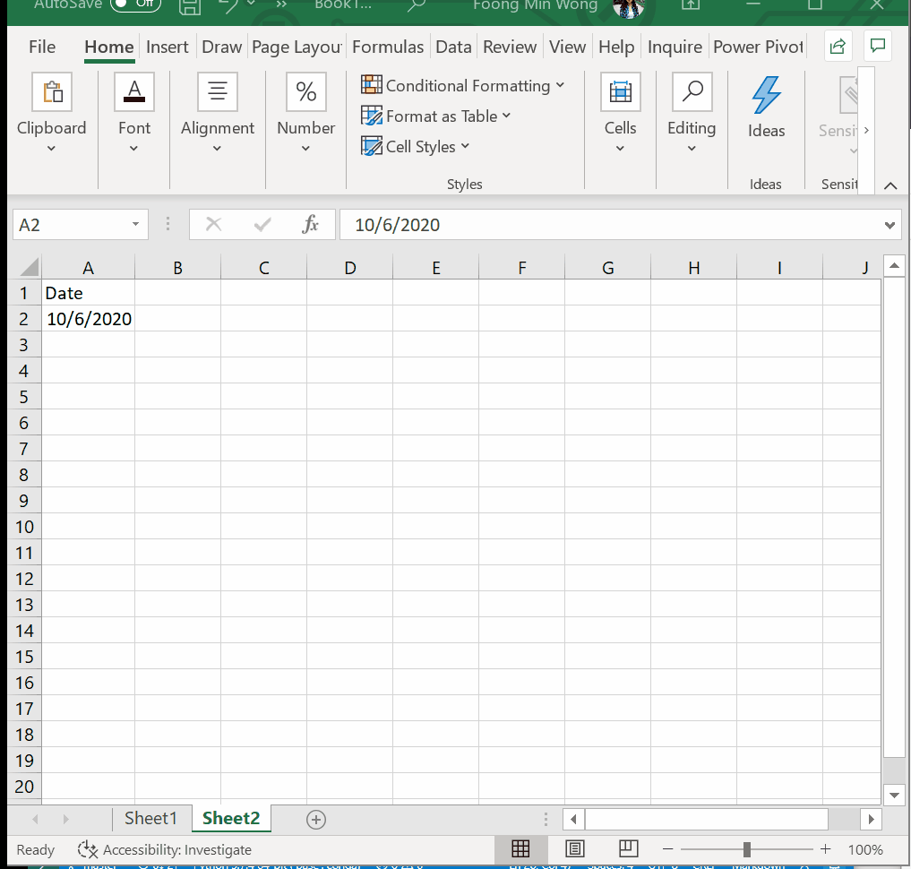
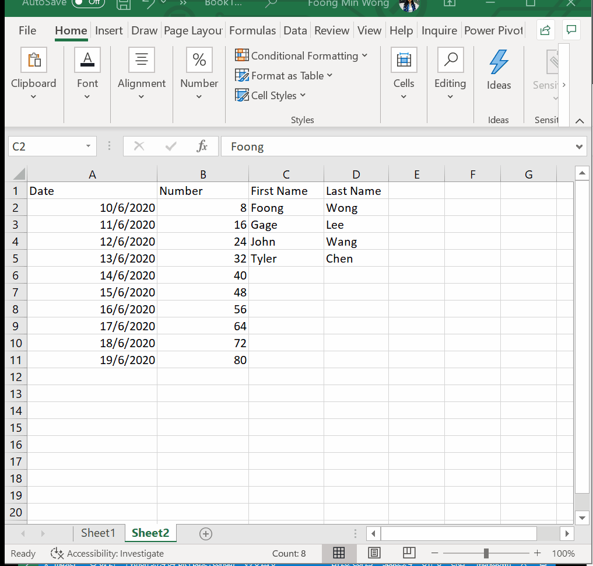

# Week 1
## Taking Charge of Excel

**Taking Charge of Excel**

* Sort Ascending - Add to Quick Access

* Numerica Data Status Bar (Average, Count, Sum)

**Navigating & Selecting**

* `PgUp`, `PgDown`, `CTRL + HOME` - takes you back to the beginning of the spreadsheet
* Hold `Shift` key & Click -> `SHIFT + CLICK`
* `CTRL + CLICK` - Multiselect

**View Options**

* Zoom 100%

* Split

* Freeze/ Unfreeze Panes

* Switch Widnows SHortcut`CTRL + F6`

**Data Entry, Data Types, Editing and Deleting**
* Escape of `ESC`- Don't want to keep changes instead of Undo
* Double Click or `F2`

* Auto Sum

**Fill Handle**

* Fill Handle - Quickly Copy, Drag, Double Click

* Can select multiple columns and double click

* Fill Handle Dates

* Fill Handle Numbers

* Fill Handle Names

* Fill Handle Email (Flash Fill)

* Fill Handle First & Last Name (Flash Fill)

**Copy & Paste**

**Templates**
