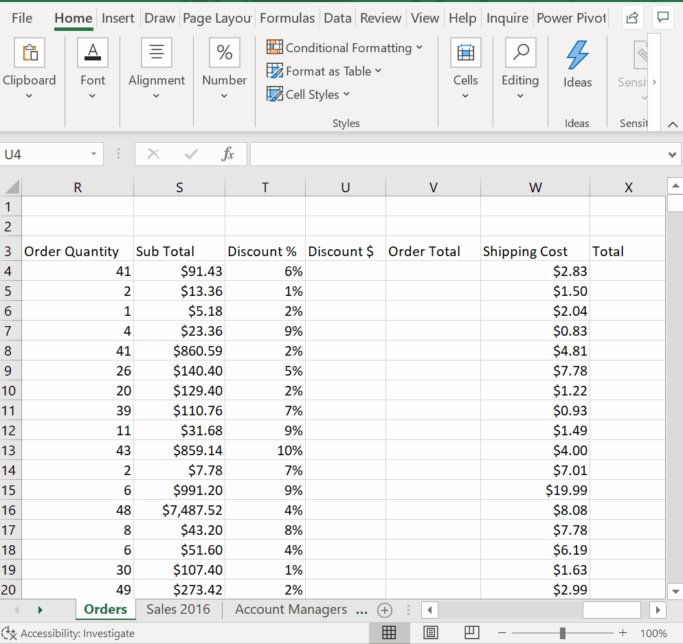
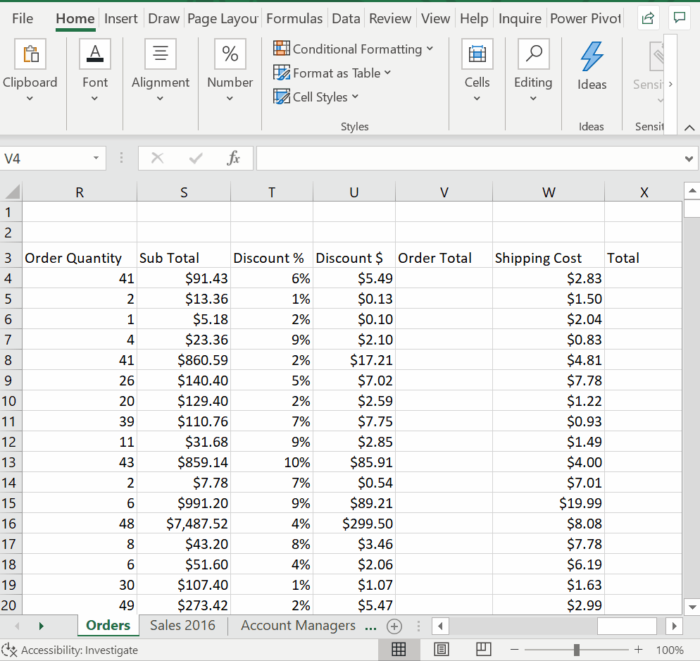

# Week 2
## Performing Calculations

**Formulas**

**Formulas in Context**

* **Shipping Spreadsheet (Cost)**

* Calculate Profit Margin - the relative profitability of a firm/business activity

* Calculate Sub Total

* Calculate Discount

* Calcualte Order Total

**Functions I: SUM and AUTOSUM**
* Autosum Function & Drag

**Functions II: AVERAGE, MIN and MAX**
* Average

* Min and Max

**Absolute Cell References**
* Prevent from copying the formula
* `F4`

**Calculations across sheets**
* Sales Data
* Relative reference across sheets
* Calculations across sheets - Part 1

* Calculations across sheets - Part 2

**Wrap-Up**
* Formulas
* Functions
* References across sheets
* Absolute, Mixed x2, Relative References - `F4
* `CTRL + ~ (CTRL + ``)` — Show formulas in the worksheet`
* `CTRL + PgUp (CMD + PgUp)` — Go to the previous sheet.
* `CTRL + PgDn (CMD + PgDn)` — Go to the next sheet.

