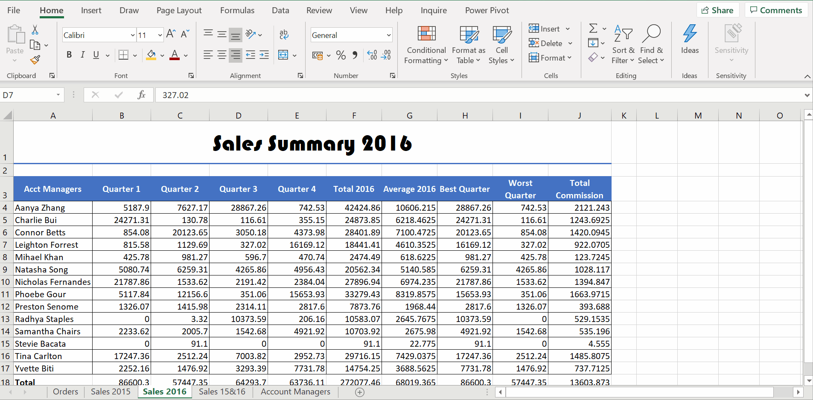

# Week 3
## Formatting Spreadsheets

**Formatting**

**Borders**

**Alignment Tools**
* Wrap Text

**Format Painter**
* Copy multiple formats simultaneously

**Number Formats**

**Styles and Themes**
* `CTRL + SHIFT + -->` select the filled cells on the right

**Graphics**