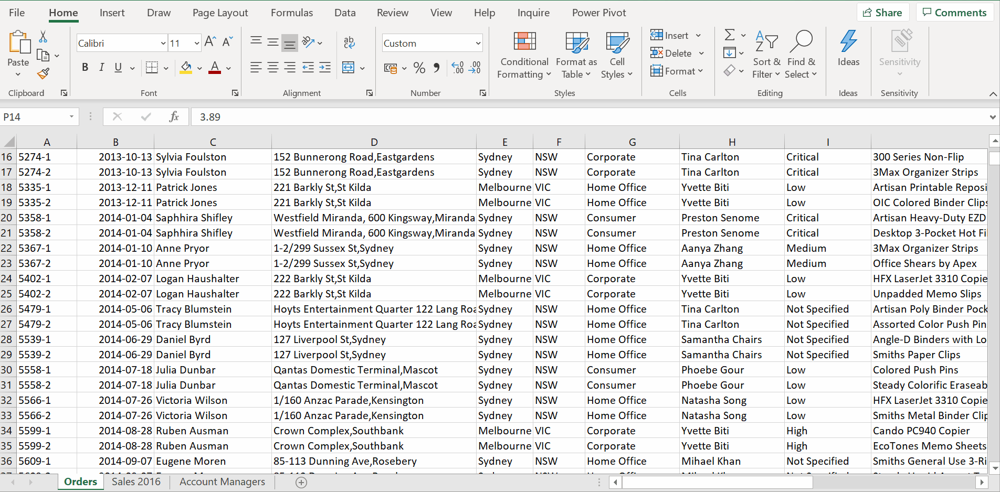
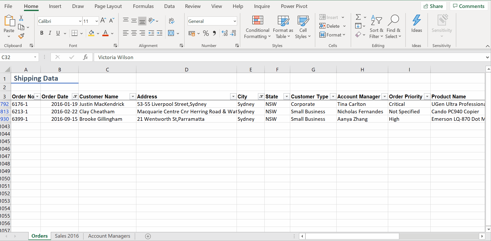
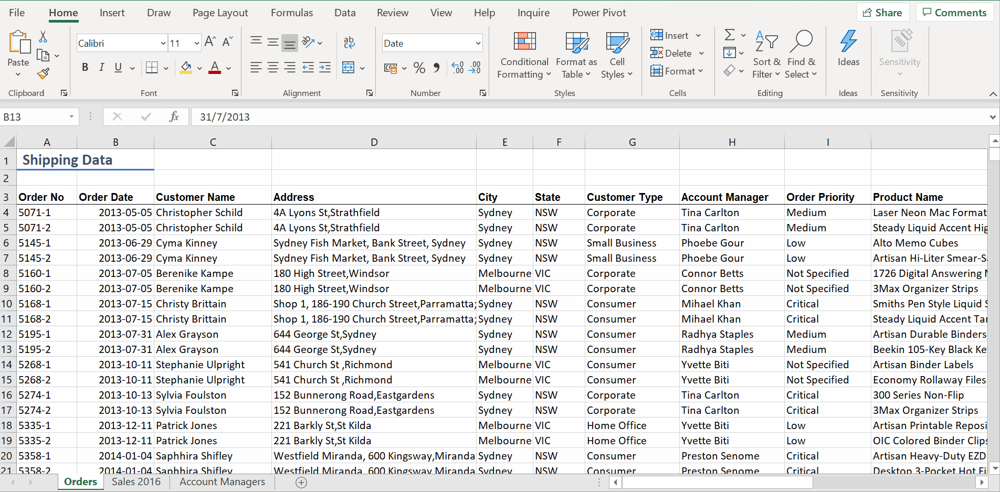

# Week 4
## Working with Data

**Managing Rows and Columns**
* Delete rows/columns - `Right Click -> Delete`
* Insert multiple 
* Hide columns instead of deleting data
* Unhide

**Find and Replace**
* Find All
* Replace All

**Filtering**
* Simple Filter

* Multiple Filters

* Clear Filter

* Top 20 Total Orders

**Sorting**
* Sort Names / `Account Manager`

* Sort More than 1 Level/ Multi-level sorting

**Conditional Formatting**
* Numeric Data

* Text Data

* Higher numbers have longer data bus, smaller numbers have shorter data bus
* Data Bars
* Color Scales - Falls within Range
* Icon Sets
* Need to select the range you want to apply `Conditional Formatting`

**Conditional Formatting vs Filtering**
Filtering will only show data that matches the criteria. You can provide multiple filters, but only data that matches all conditions will be visible.

Conditional formatting will show data that fits any of the conditions chosen. It also provides more visual and graphical elements.