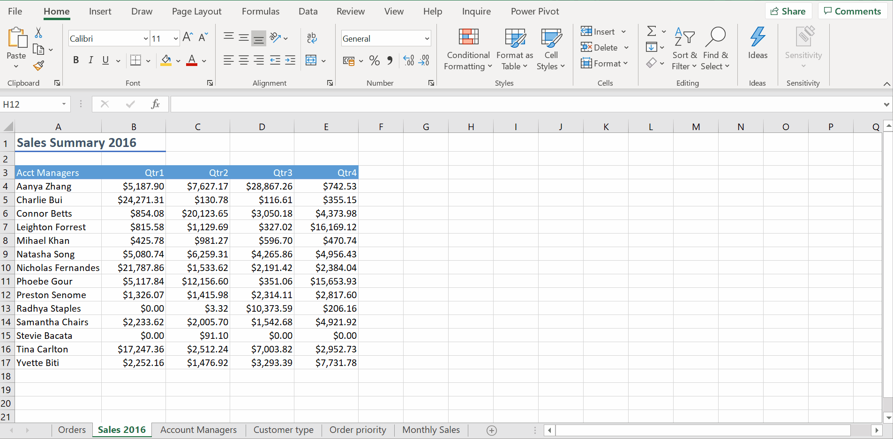

# Week 6
## Creating Charts and Graphs

**Creating Charts and Graphs**

**Basic Chart Types: Pie, Column and Line Charts**
* Pie Chart - can only include single series of data

* Column Chart - compare different data series/ performance of account managers, see the absolute value

* Column Chart - Fill Handle

* Line Chart - Time Series data, data trend, performance across different quarters

**Move and Resize Charts**
* Move charts - Right Click -> Move Chart to different/new sheet
* Don't need to copy chart anymore

**Change Chart Style & Type**
* Chart Styles primarily changes the font and shading of existing chart elements, 
whereas Quick Layout alters the types of chart elements that are displayed and their location 
in the Chart Area.

**Modify Chart Elements**

**Sharing Charts**

**Final Assessment**
* Expenditure report

