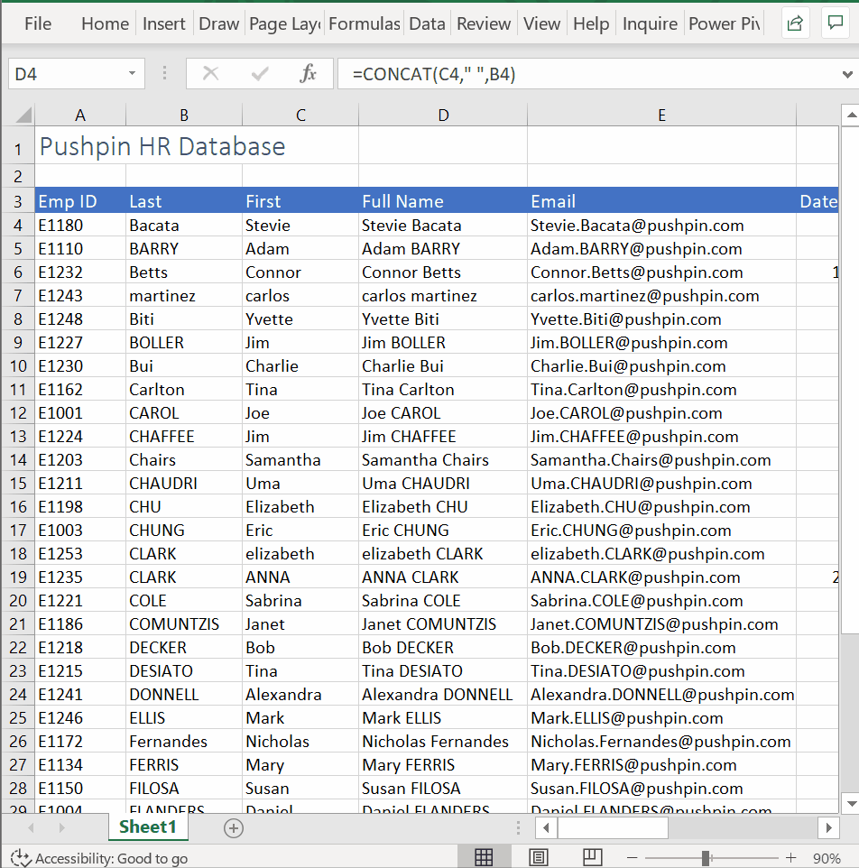
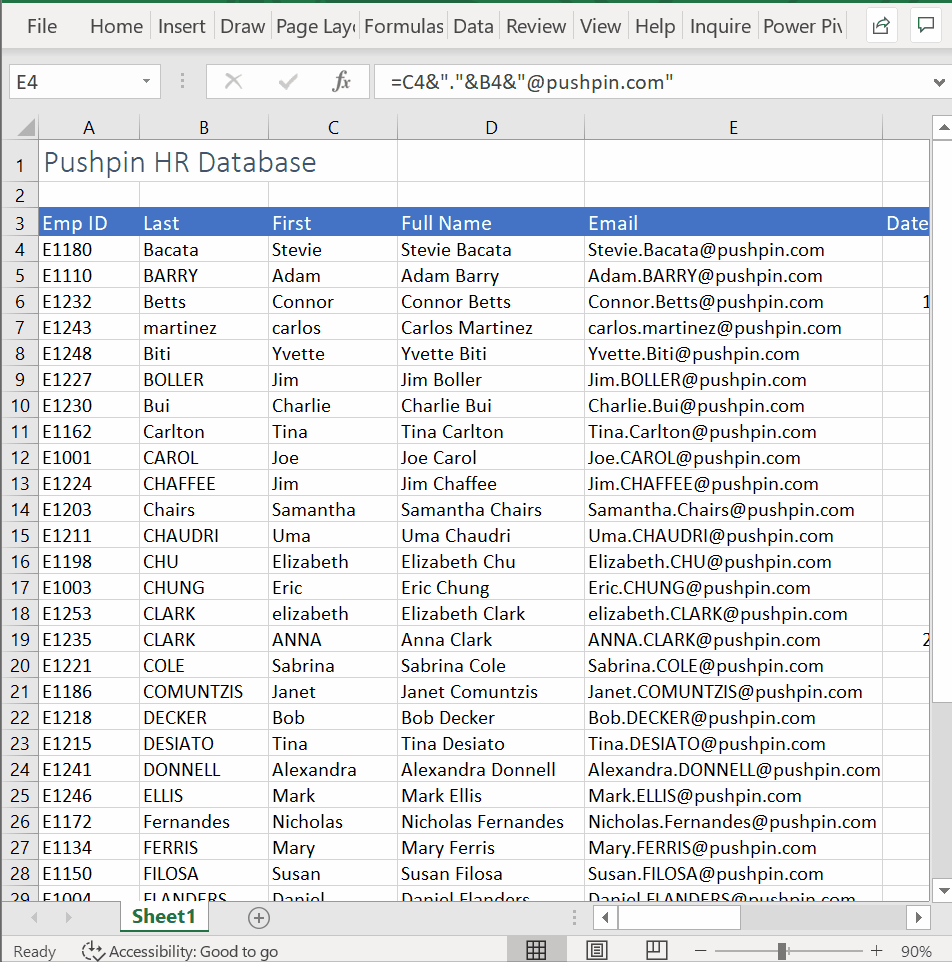
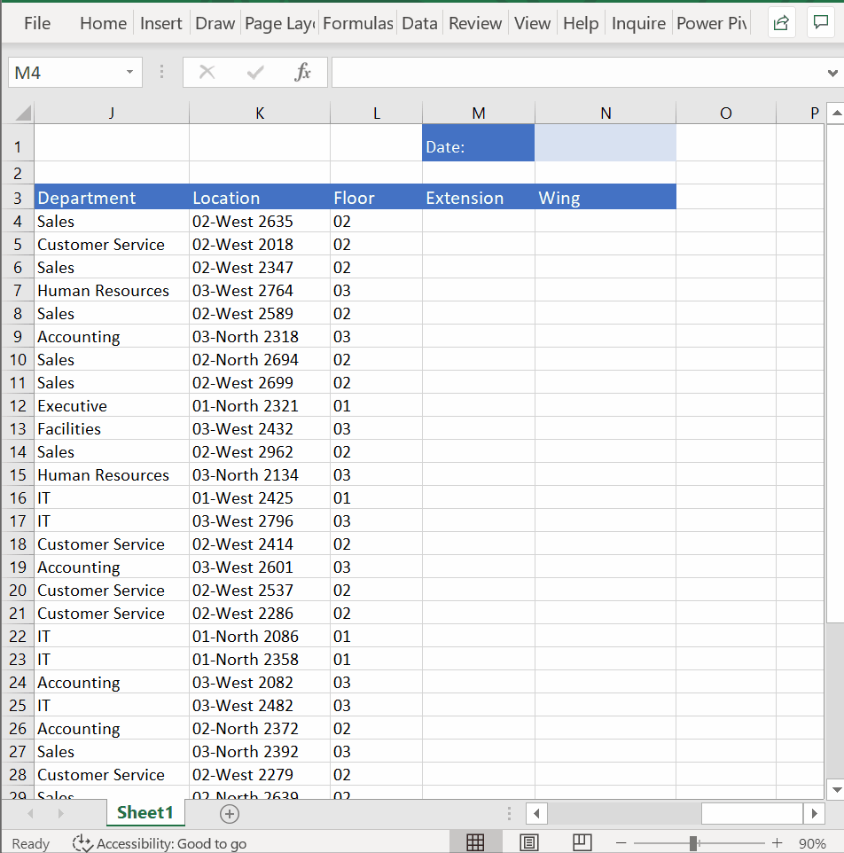
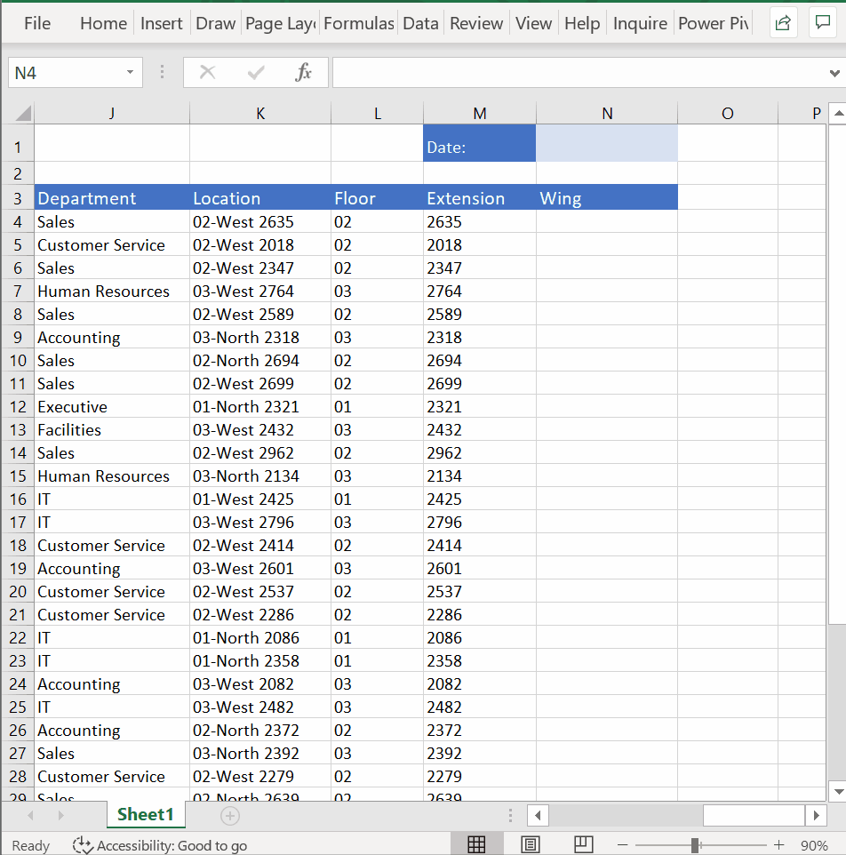
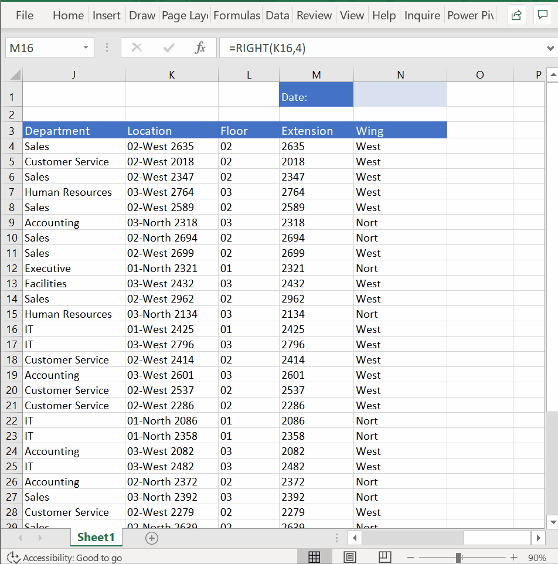
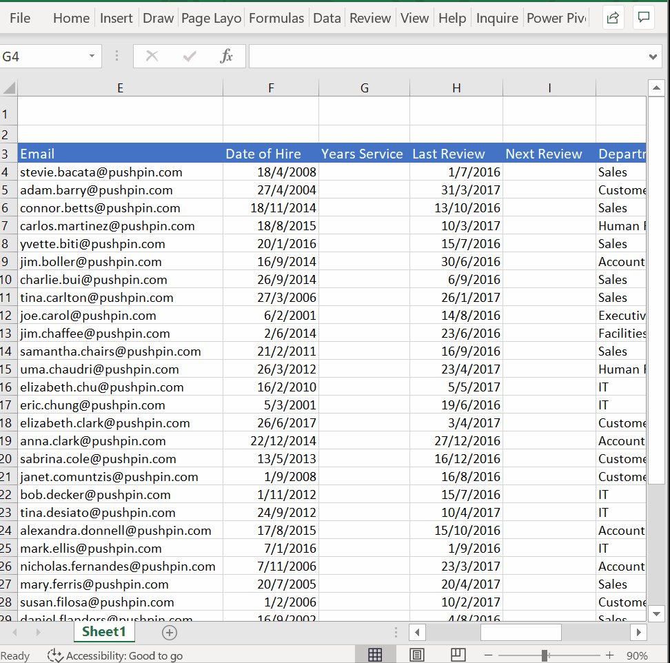
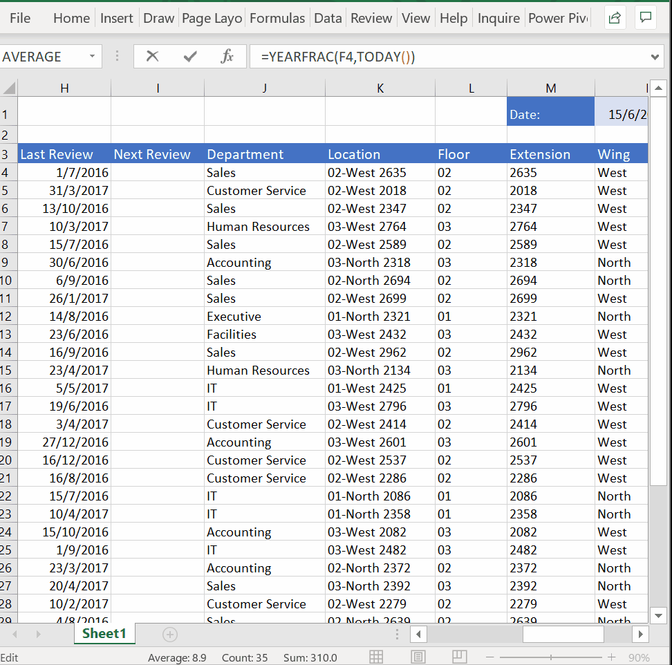

# Week 2
## Text & Date functions

**Combining Text (CONCAT, &)**
* Concatenate, linking together
* `=CONCAT()`
* Concat names

* Ampersand sign, concat emails

**Changing Text Case (UPPER, LOWER, PROPER)**
* `=PROPER(CONCAT(C4," ",B4))`

* `=LOWER(C4&"."&B4&"@pushpin.com")`

**Extracting Text (LEFT, MID, RIGHT)**
* `=LEFT(K4,2)`

* `=RIGHT(K4,4)`

* `=MID(K4,4,4)` - Managed to get `WEST`, `NORT` but not `NORTH`

**Finding Text (FIND)**
* `=MID(K4,4,FIND(" ",K4)-4)`

**Date Calculations (NOW, TODAY, YEARFRAC)**
* `=NOW()` or `=TODAY()`
* `=YEARFRAC(F4,TODAY())`

* Add 365 for next year
* `=H4+365`

This keyboard shortcut `CTRL+;` will insert the current date as a fixed value that will not change the next time you open the spreadsheet. The TODAY() function will display the current date and update when you open the spreadsheet.
* In 2017, the Christian celebration of Easter occurred on Sunday, 16 April. What fraction of the year was this? (to 1 decimal place)
* Answer: `=YEARFRAC(1/1/2017, 16/4/2017)`

**Final Assessment**
* Inventory Items
* `=CONCAT(RIGHT(Inventory!F4,3),LEFT(RIGHT(Inventory!F4,9),4))`
* `=LEFT(Inventory!B4,FIND(",",Inventory!B4)-1)`