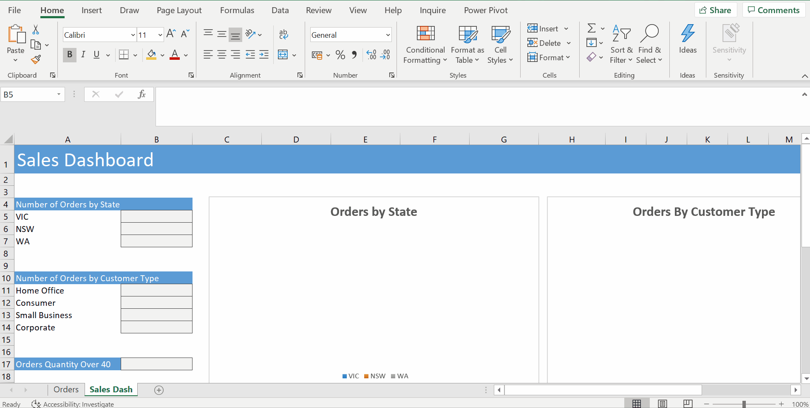
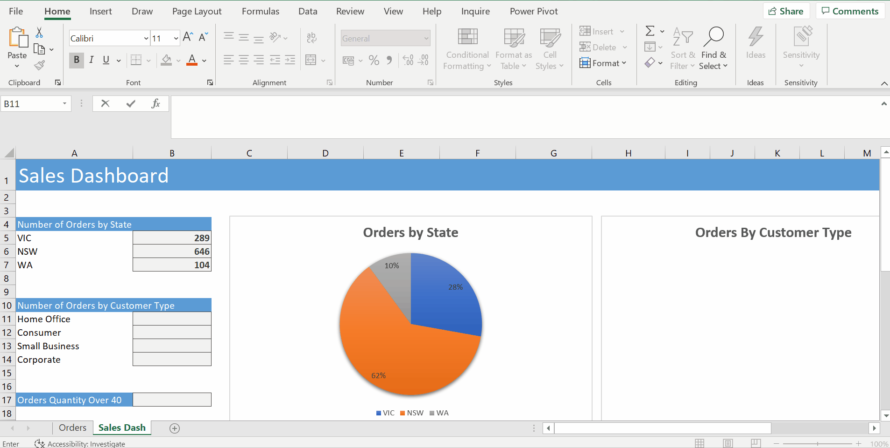
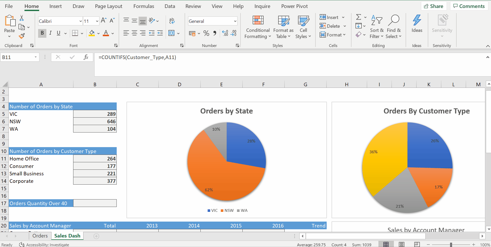
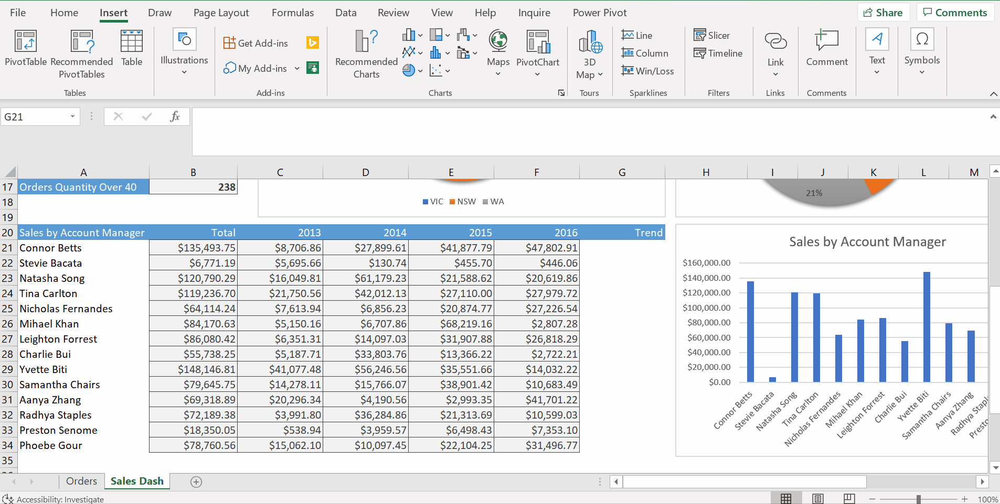
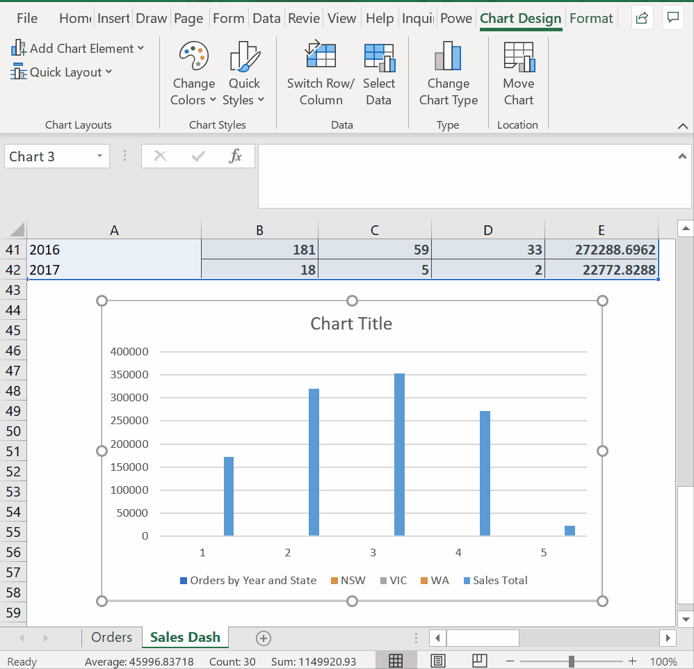
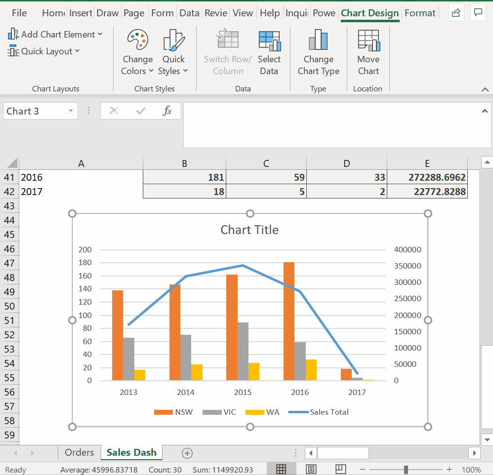
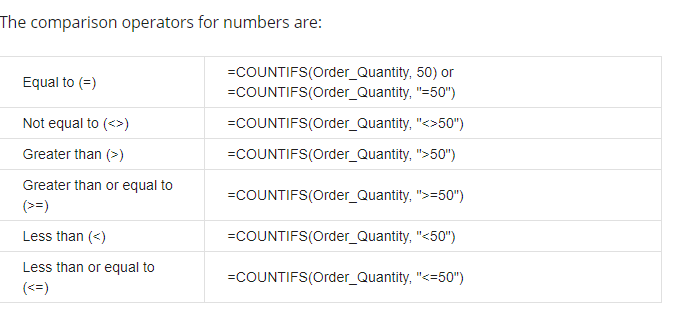

# Week 4
## Summarising data

**COUNT functions**
* Working on Shipping Data
* `COUNT`- counts number of cells that contain numeric values
* `COUNTA` -counts non empty cells both numerical & alphanumerical data, number that is not numeric like `Oder No.` with hyphen
* `COUNTBLANK`

**Counting with Criteria (COUNTIFS)**
* `=COUNTIF(State,A5)`

* `=COUNTIFS(Customer_Type,A11)`

* `=COUNTIFS(Order_Quantity,">40")`

**Adding with Criteria (SUMIFS)**
* `=SUMIFS(Total,Account_Manager,A21)`
* `=SUMIFS(Total,Account_Manager,$A21,Order_Year,C$20)`

* Fix Relative Reference to Absolute Cell Reference
* $A21 - The `$` is now in front of A which means the column is locked, not in the front of 21 which means that the row is relative
* C$20 - No `$` in front of the C which means the column is relative
* Mixed cell references, $ just locks whatever
* The way the SUMIFS function works is that if you specify more than one criteria, all of the criteria need to be met before Excel can start summing. In other words, you are telling Excel that both criteria need to be met, rather than either of the criteria need to be met. Have another go.

**Sparklines**
* Show the trend (LIne or columns)
* Insert a small chart in a cell

**Advanced Charting**
* Fix the x axis

* Change Chart Type - Combo Chart, sales total to the secondary axis

* Don't want to show negative trend
* Visual representation of our sales trends

**Trendlines**
* Forecast what future values may look like if they follow that pattern

 

* `CTRL + SHIFT + >` - make it bigger

**Wrap Up**
* Create good-looking dashboards summarize and present data
* Building blocks: reporting functions, sparklines, advanced charting
* these are case-insensitive: `=COUNTIFS(Product_Container, "Small Box")` and `=COUNTIFS(Product_Container, "small box")` do the same thing.
* ? and *. These are called wildcards and can take the place of a single letter (?) or many letters (*).

* If you only have 1 criteria that you want to count, these functions are identical. However, you can also use COUNTIFS when you have multiple criteria. Other functions that follow this pattern are SUMIF/SUMIFS and AVERAGEIF/AVERAGEIFS. We recommend that you always use the -IFS versions of these functions.
* `COUNTIF(range, criteria)`
* `COUNTIFS(criteria_range1, criteria1, [criteria_range2, criteria2]…)`