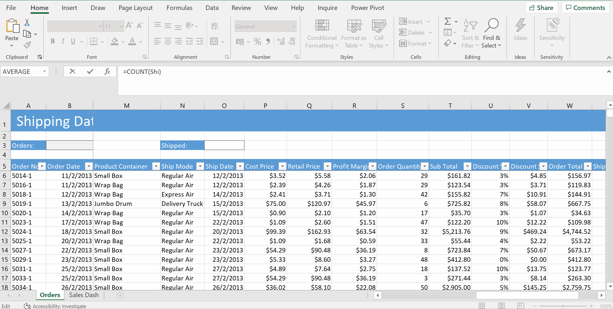

# Week 4
## Summarising data

**COUNT functions**
* Working on Shipping Data
* `COUNT`- counts number of cells that contain numeric values
* `COUNTA` -counts non empty cells both numerical & alphanumerical data, number that is not numeric like `Oder No.` with hyphen
* `OCUNTBLANK`

**Counting with Criteria (COUNTIFS)**
* `=COUNTIF(State,A5)`

* `=COUNTIFS(Customer_Type,A11)`

* `=COUNTIFS(Order_Quantity,">40")`

