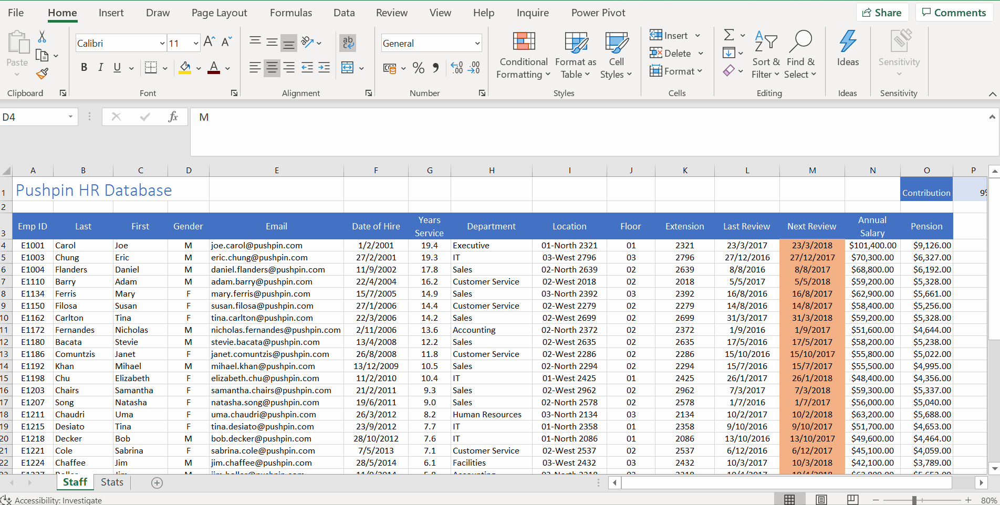
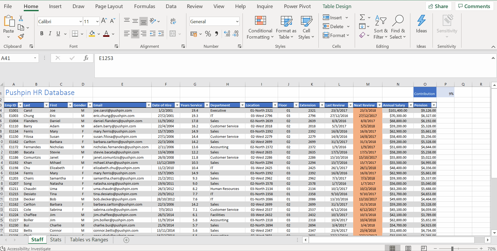
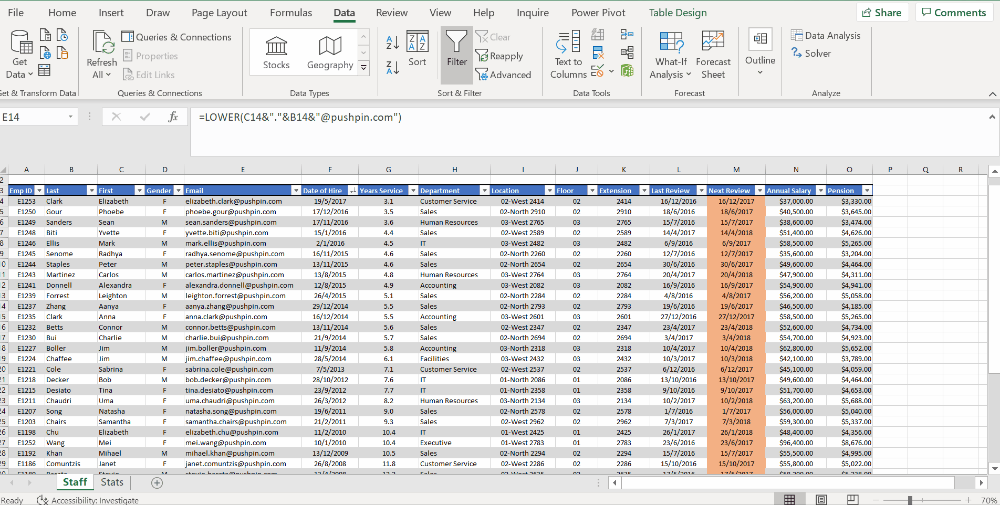
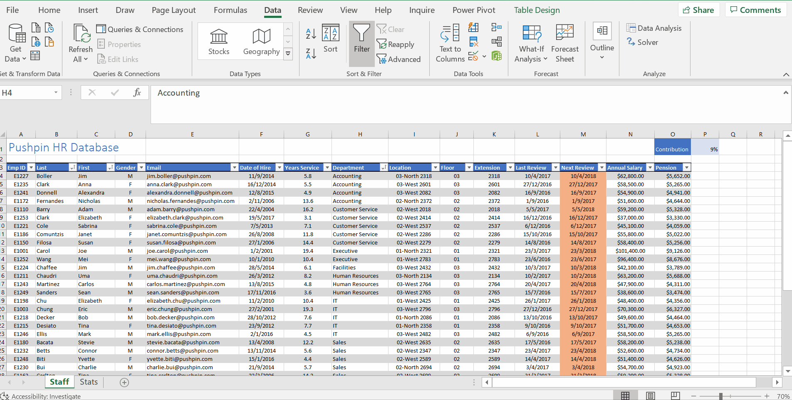
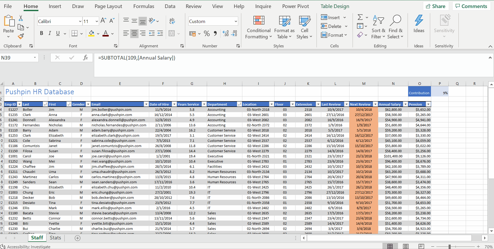
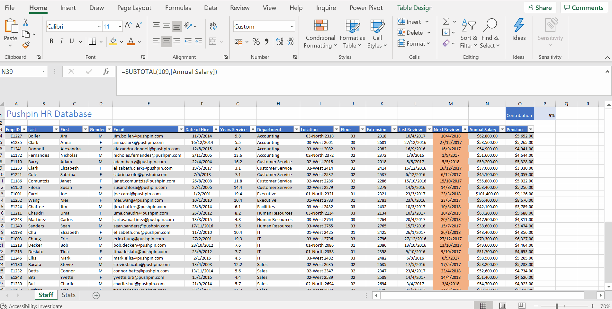
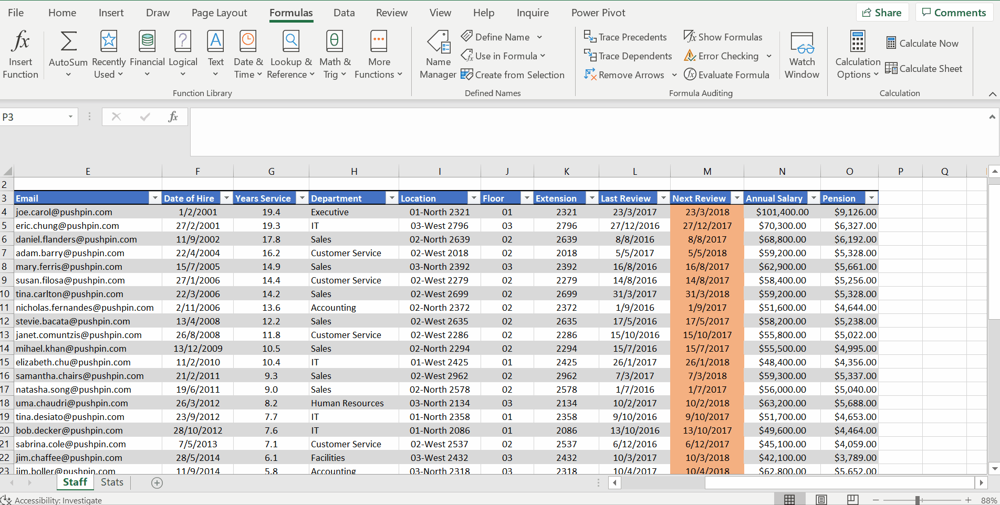

# Week 5
## Tables

**Intro**
* Tables -Excel Version of database

**Creating and Formatting Tables**
* Table tools - contextual ribbon tab
* Create table

* Table Style Option

* Create Table Shortcut Key - `CTRL + T`

**Working with Tables**
* Diagonal Arrow
* Conditional Formatting - show duplicates then remove (Table Tools -> Design)

**Sorting and Filtering in Tables**
* Right click context menu, access them on header row 
* Data and add multiple levels of sort order

* Total Row - makes reporting super quickly

* Get Top 5 earners

* Years Service (Above Average)

* Good practice to clear filter when work on a shared Excel environment

**Automation with Tables**
* `CTRL + SHIFT + WITH +` - create a new row
* `CTRL + ; ` - to enter today's date as a fixed value
* Named ranges will now extend to row 39
* Press `Tab` once in the last cell of the last table row
* auto-exending rows

* Automation styling when adding a new column

* Structured references:
	* can be used in calculations.
	* structured references and named ranges are used for similar things but do have slight differences. One thing is that structured references are automatically created in tables, where named ranges are created manually.
	* structured references are created automatically in tables.
	* structured references can have relative cell referencing.