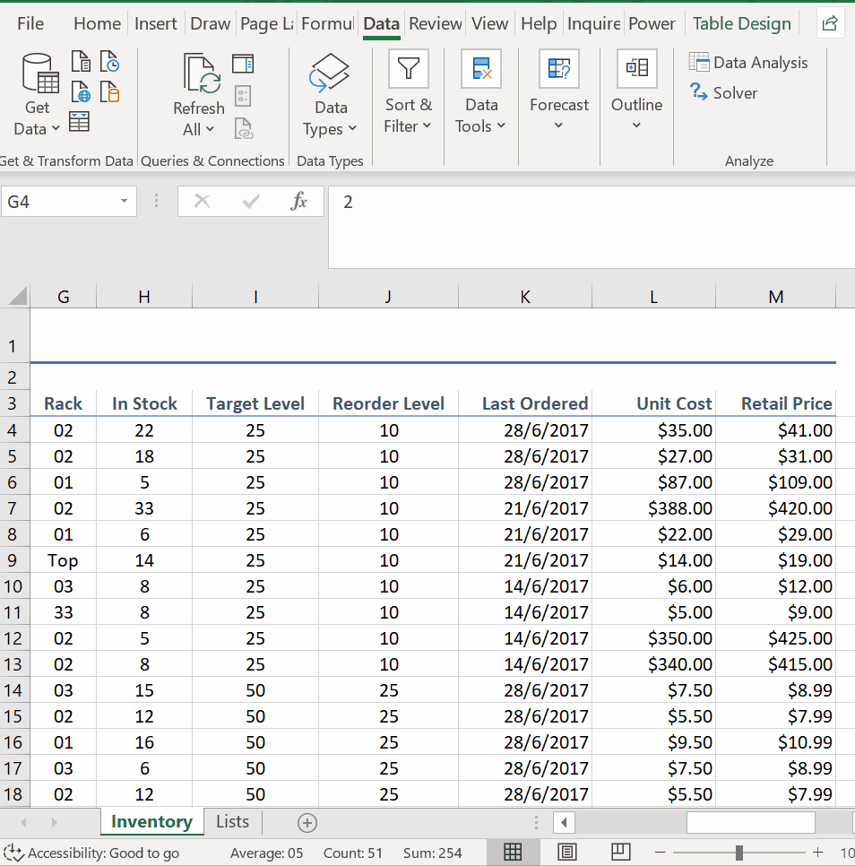
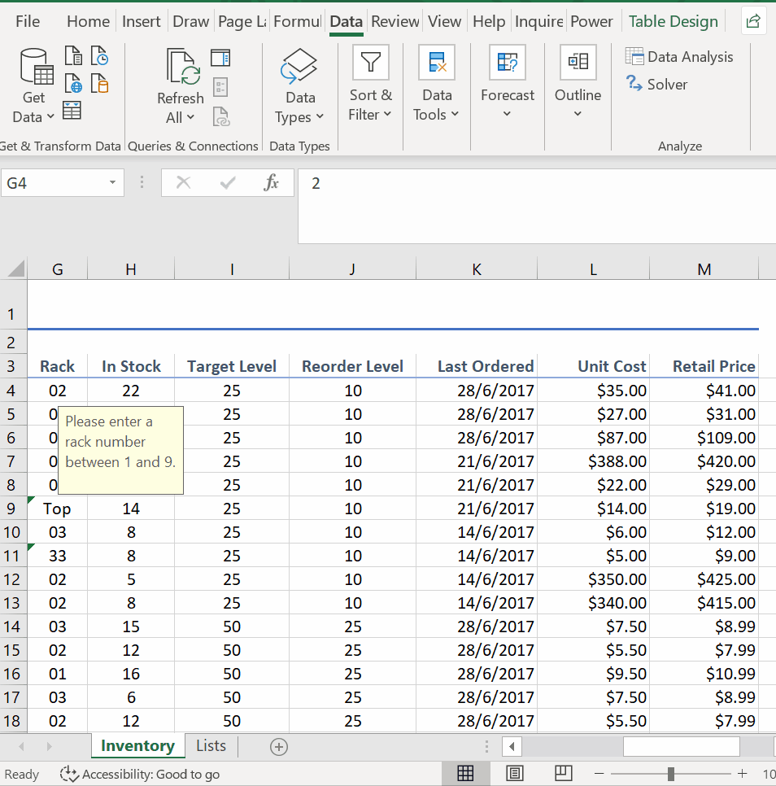
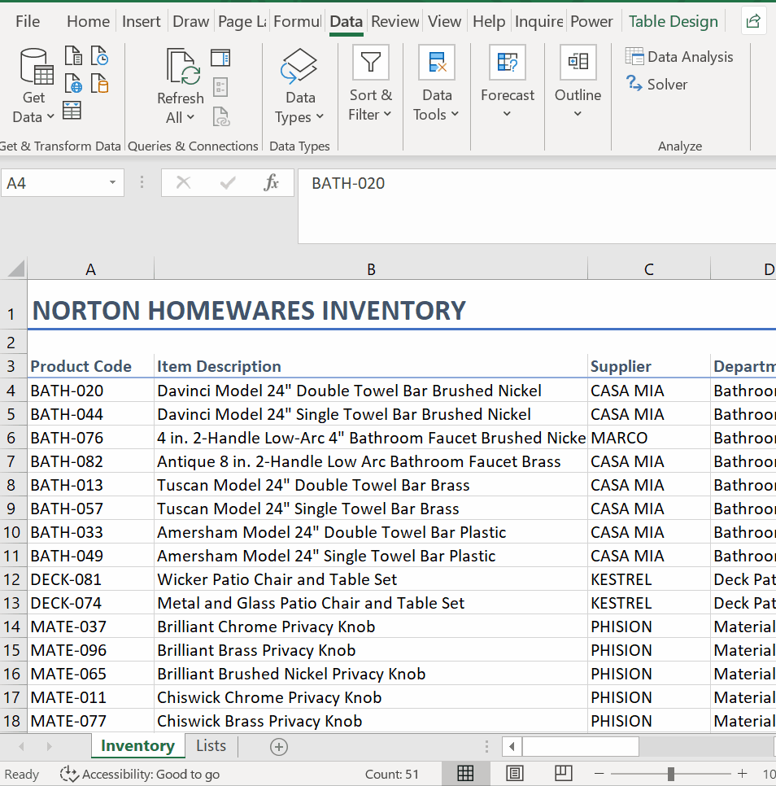

# Week 1
## Data Validation

**Data Validation**
* *Valid data means valid results out*
* Possibility of human error
* Example: Inventory Spreadsheet
* Must select the cells that we want to work

* Data Error

* Text Length Data Validation

