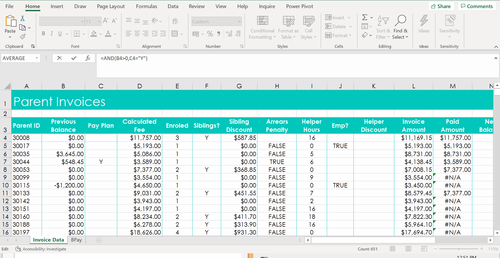
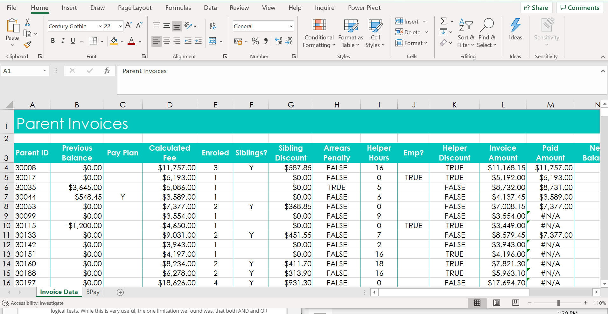
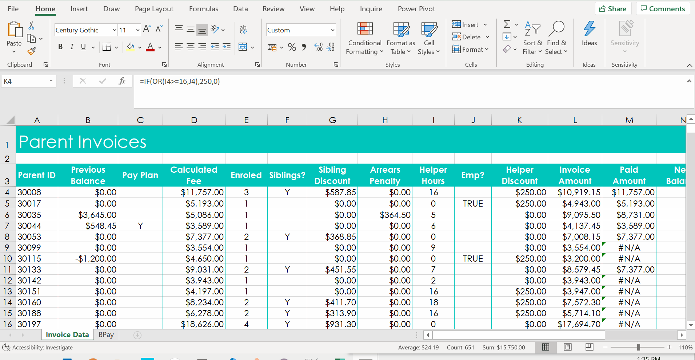
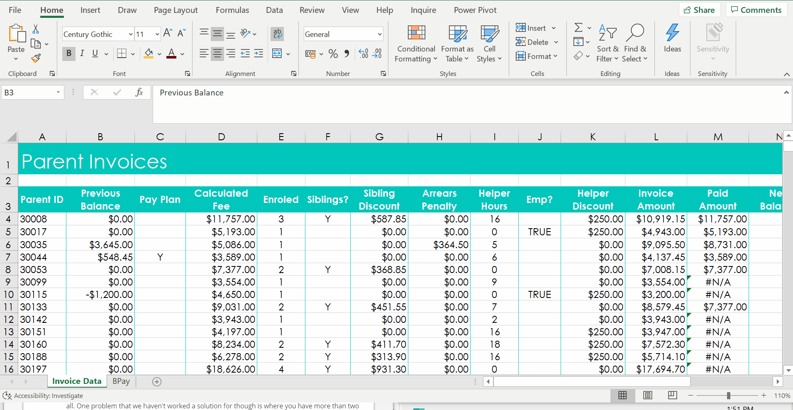
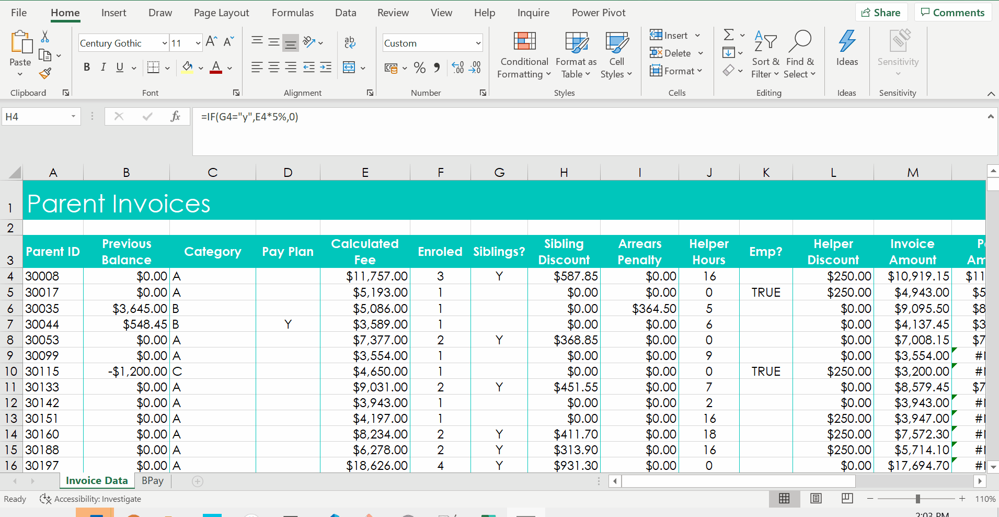
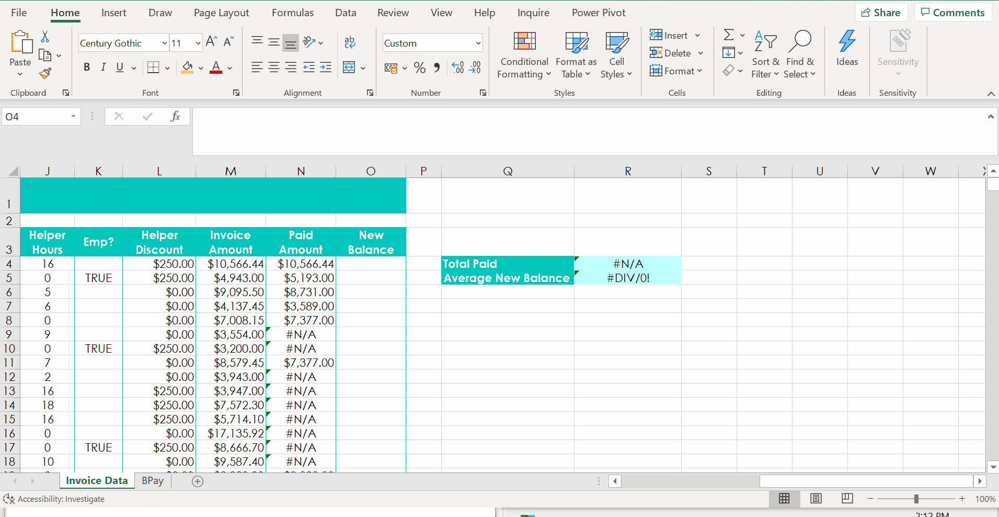

# Week 2
## Conditional Logic (Logical functions)

**Logical Functions I: IF**
* Example: Parent Invoices
* Have siblings `=IF(E4>=2,"Y","")`

* Have sibling discount, `=IF(F4="y",D4*5%,0)`
* equals is not case sensitive

**Logical Functions II: AND, OR**
* Arrears Penalty `=AND(B4>0,C4="Y")`

* Helper or Employee Discount `=OR(I4>=16,J4)`

* TRUE if cells X1, Y1, Z1 are in ascending order `=AND(X1<Y1,Y1,Z1`

* TRUE if at least 2 cells with same value `=OR(X1=Y1,X1=Z1,Y1=Z1)`

**Combining Logical Functions I: IF, AND, OR**
* Calculate 10% Arrears Penalty `=IF(AND(B4>0,C4<>"Y"),B4*10%,0)`

* Calculate Helper or Employee Discount `=IF(OR(I4>=16,J4),250,0)`

**Combining Logical Functions II: Nested IFs**
* `CTRL + PLUS` - new column
* Previous Balance Category `=IF(B4=0,"A",(IF(B4>0,"B","C")))`

* Calculate multi-ifs sibling discount `=IF(G4=1,0,(IF(F4=1,E4*5%,E4*8%)))`

**Handling Errors: IFERROR, IFNA**
* N/A - Not Applicable

* IFERROR `=IFERROR(AVERAGE('Invoice Data'!$O$4:$O$654),"")`

* IFNA  `=IFNA(VLOOKUP('Invoice Data'!$A4,BPay!$B$4:$D$10,3,0),0)`
* If it doesn't look up the value, return 0

**More Logical Functions**
* NOT - `=IF(NOT(A5=1), B5*5%,0)`
* EXACT - `=IF(Exact(A5, "JOHN"), B5*5%,0)`

