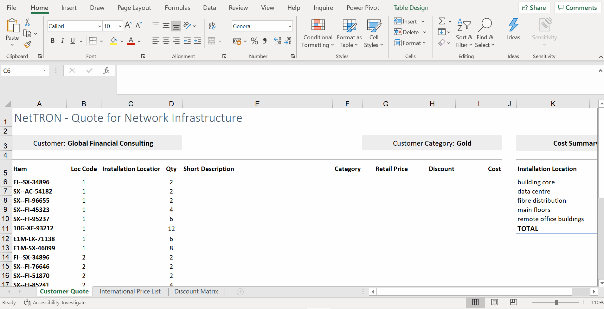

# Week 3
## Automatic Lookups

**Introduction to Lookups: CHOOSE**
* `CHOOSE` - retrieve a value from a list based on a given numeric value
* do  alookup from a very finite list
* `=CHOOSE([@[Loc Code]],$K$6,$K$7,$K$8,$K$9,$K$10)`

* `CHOOSE` 1st argument -> index number
* The values in the CHOOSE function need to be listed individually, separated by a comma. This can take a long time to set up when you have lots of values.