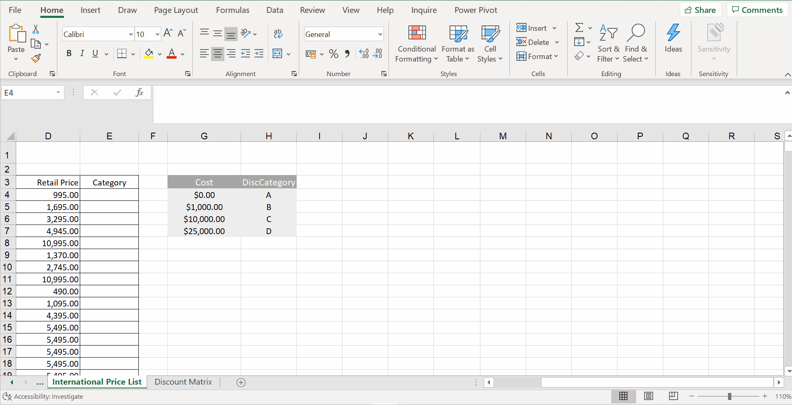
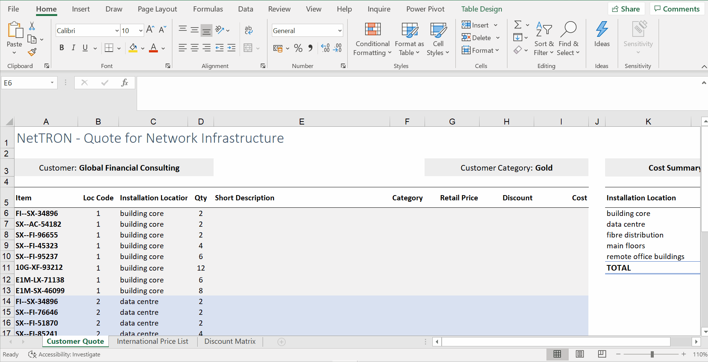
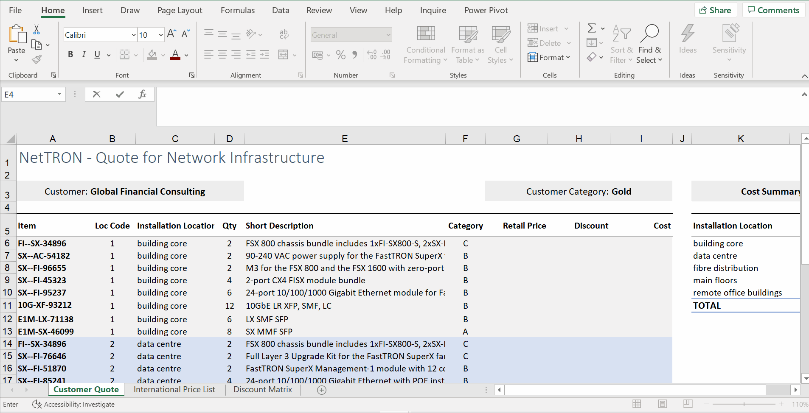
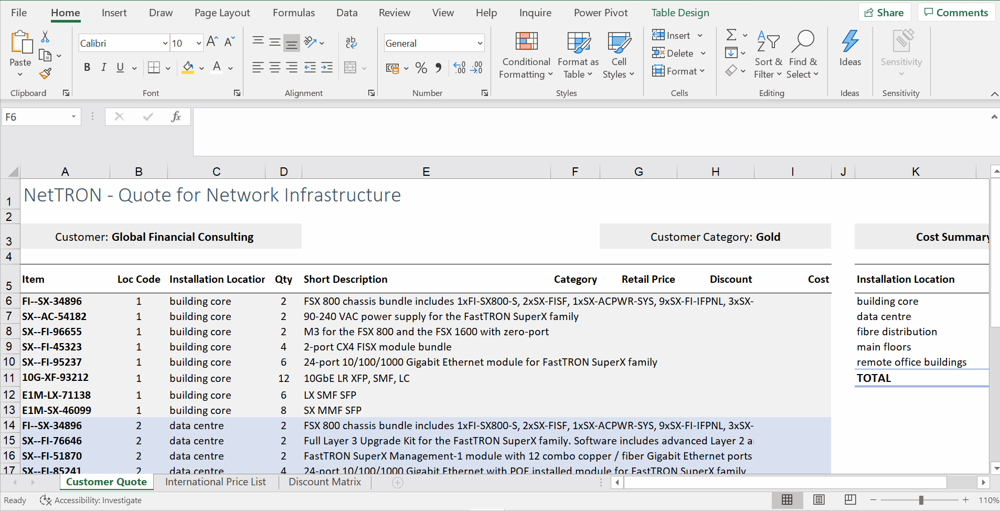
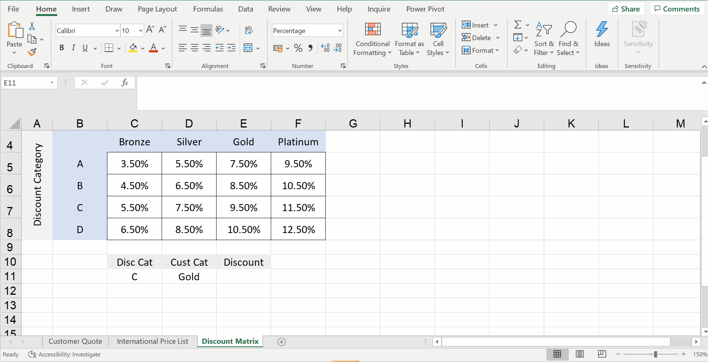
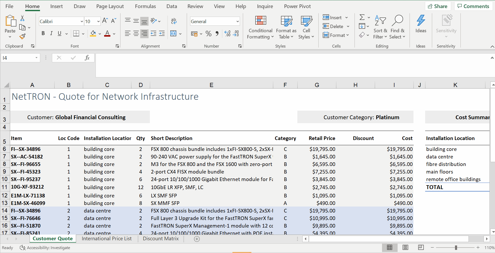

# Week 3
## Automatic Lookups

**Introduction to Lookups: CHOOSE**
* `CHOOSE` - retrieve a value from a list based on a given numeric value
* do  alookup from a very finite list
* `=CHOOSE([@[Loc Code]],$K$6,$K$7,$K$8,$K$9,$K$10)`

* `CHOOSE` 1st argument -> index number
* The values in the CHOOSE function need to be listed individually, separated by a comma. This can take a long time to set up when you have lots of values.

**Approximate Matches: Range VLOOKUP**
* press `F4` to make them absolute
* `=VLOOKUP(D4,$G$4:$H$7,2)`
* The lookup data set that the table_array points to should be listed from smallest to largest, the range should be referred to with absolute references, and headings should not be included.

**Exact Matches: Exact Match VLOOKUP**
* exact matches - false
* `=VLOOKUP([@Item],'International Price List'!A5:$E$1254,3,FALSE)`

* VLOOKUP with Table (more automation)
* `=VLOOKUP([@Item],parts,3,FALSE)` or `=VLOOKUP([@Item],parts,3,0)`

* Q: When is it appropriate to use an exact match VLOOKUP?
	* A: When you are dealing with a lookup value with a unique identifier, such as bank account numbers, and you want to match to a vertical table.

**Finding a Position: MATCH**
* `MATCH` - miniature of VLOOKUP (don't need to worry about horizontal or vertical)
* dragging will get relative references
* `=VLOOKUP([@Item],parts,E$4,FALSE)`

* paste formulas

**Dynamic Lookups: INDEX, MATCH**
* `=INDEX(Discounts,3,2)`

* INDEX with MATCH function (automation)
* `=INDEX(Discounts,MATCH(C11,Discount_Categories,0),MATCH(D11,Customer_Categories,0))`

![]screenshot/index-with-match.gif)

* Discount Category (A, B, C, D) with Customer Category (Bronze, Silver...)
* `=MATCH(I3,Customer_Categories,0)`
* `=INDEX(Discounts,MATCH([@Category],Discount_Categories,0),$I$4)`

* MATCH function - returns the position of a lookup value in the lookup array
* INDEX function - returns the value

* The INDEX MATCH can do horizontal and vertical lookups at the same time.
* MATCH is used to define the second and/or third argument, i.e., the row or column parameter, of the INDEX function. By using MATCH instead of defining this manually, the function becomes a lot more versatile and automated.
