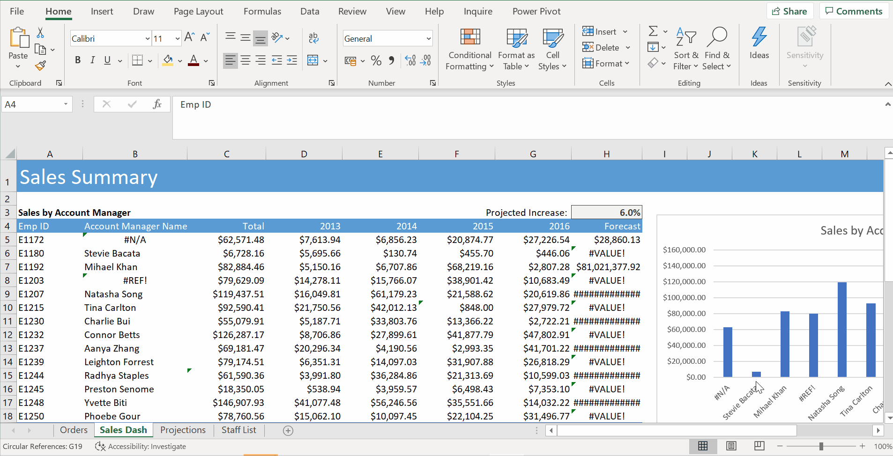
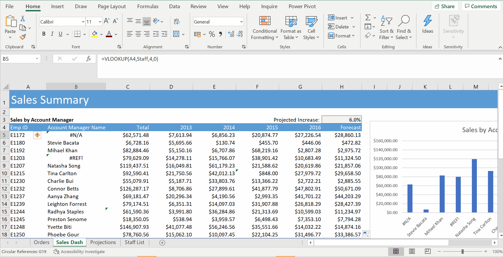
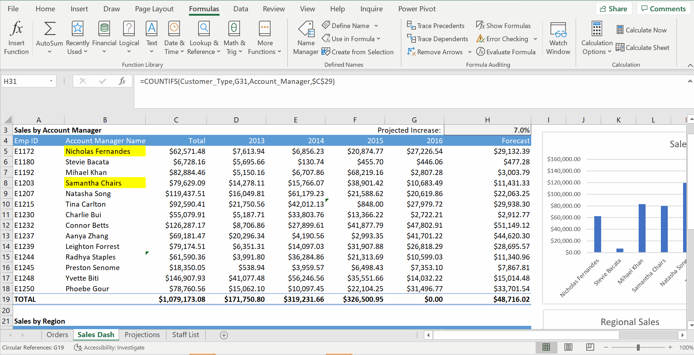
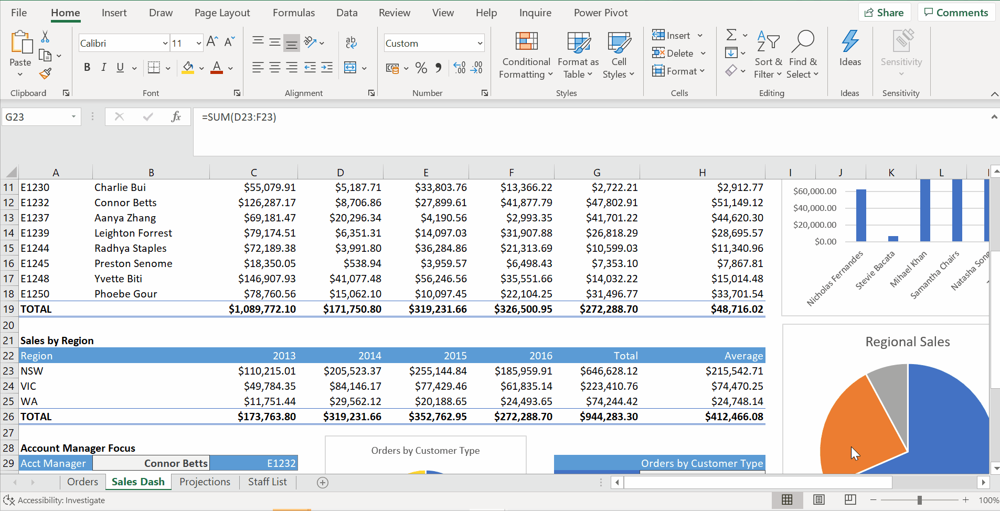
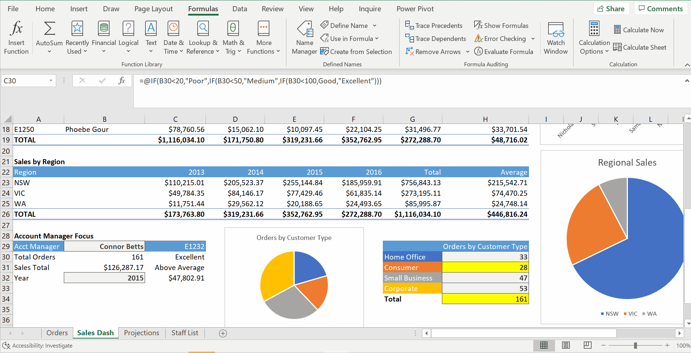

# Week 4
## Formula Auditing and Protection

**Error Checking**
* Make to Absolute Reference - easy to spot error

* Big dataset - Find -> Go to Special -> Formulas -> Check `Errors`
* `Formula Auditing` -> `Error Checking`
* `Show Calculation Step`

* `Show Formulas` under Formulas

* `Error Checking` -> `Trace Error`

**Formula Calculation Options**
* `Circular Reference`
* inconsistent formula - copy formula from above

* Error checking options, manual calculations, calculate now
* Set it back to automatic

**Trace Precedents and Dependents**
* precedent - a cell that is referred to in a formula
* dependent - a formula that refers to your cell

**Evaluate Formula, Watch Window**
* Evaluate Formula - 1

* Evaluate Formula - 2 - Wrong Column

* Watch Window

