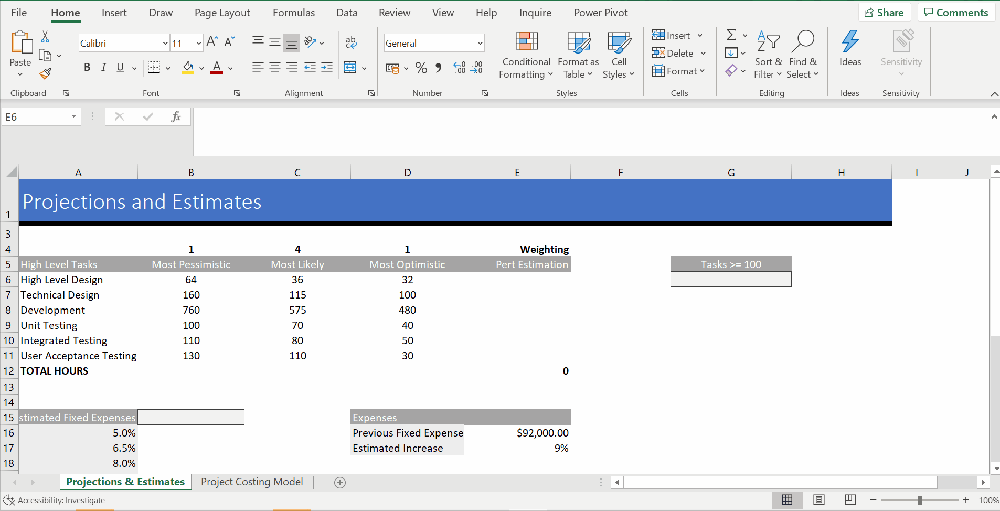
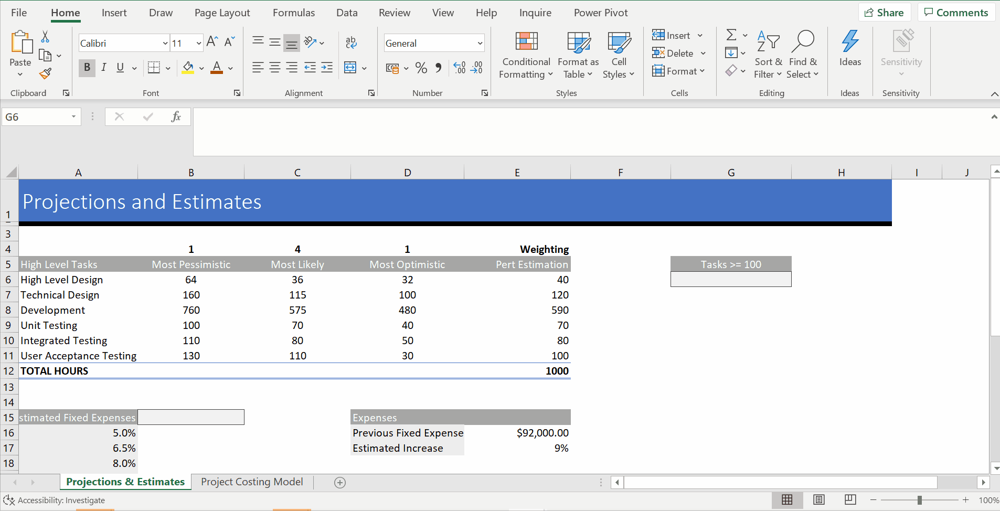
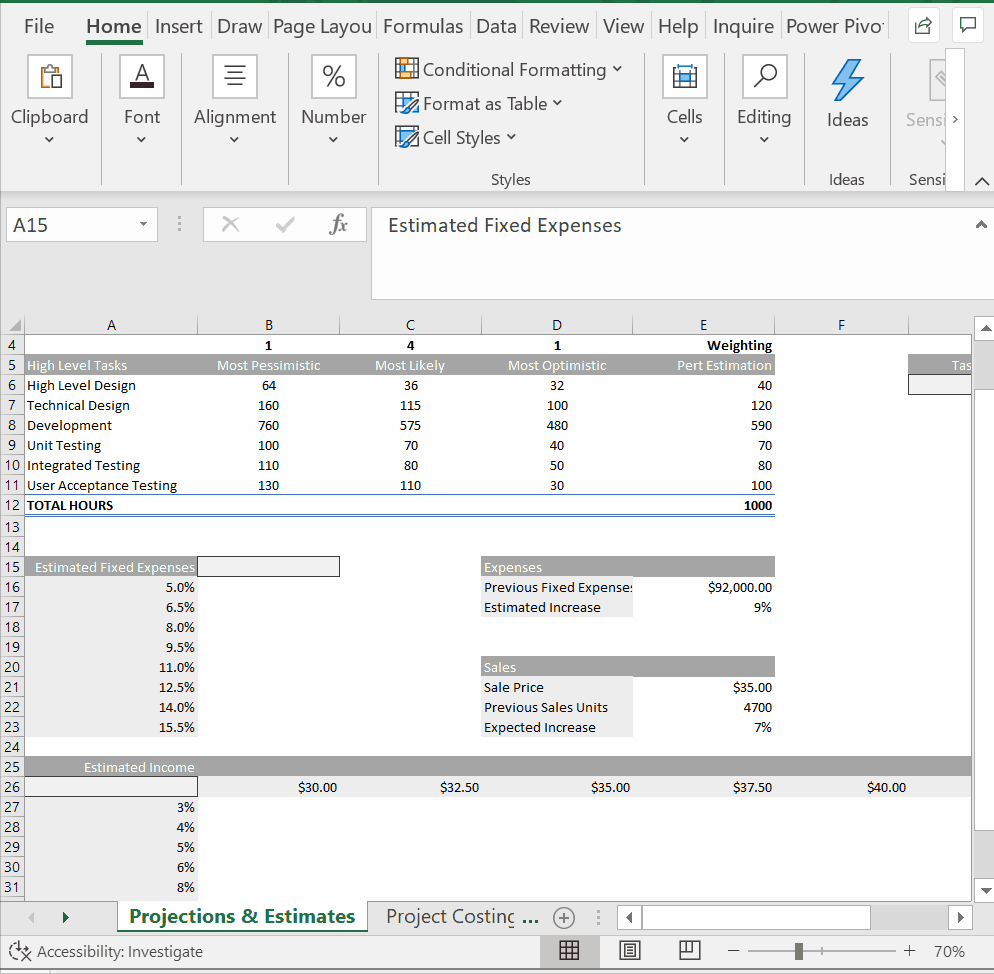
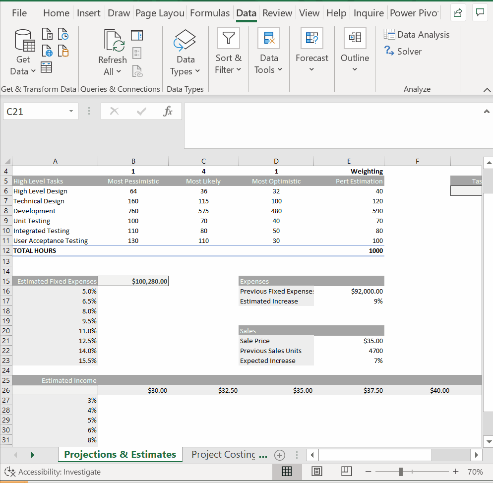
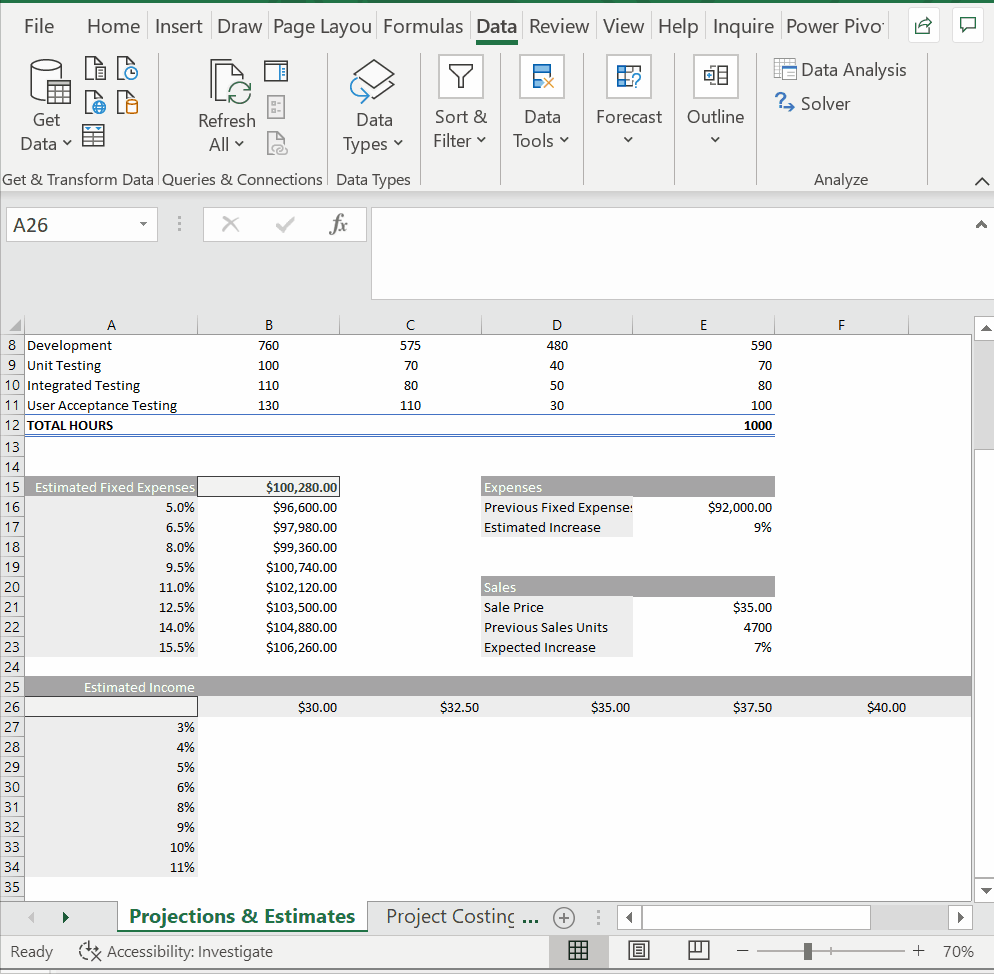
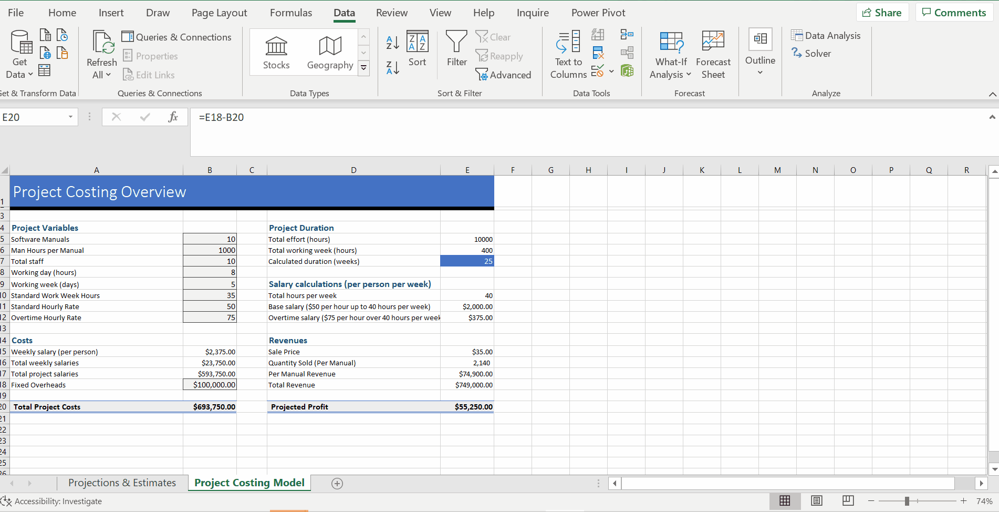
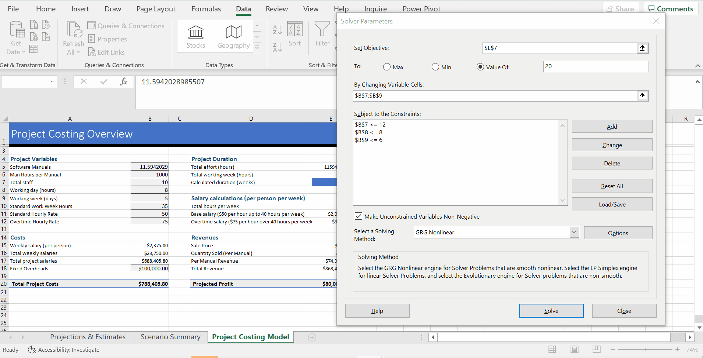

# Week 5
## Data Models

**Modelling Functions: SUMPRODUCT**
* Example: Software Manuals - model the project cost and revenue in Excel
* `SUMPRODUCT`
* Calculate `Weighted Average` - `=SUMPRODUCT(B6:D6,$B$4:$D$4)/SUM($B$4:$D$4)`

* Check each value if they're greater than or equal to 100
* Do logical test inside SUMPRODUCT
* `=SUMPRODUCT(1*(E6:E11>=100))`

**Data Tables**
* See a range of different outcomes using different inputs using just 1 formula

* `Data` -> `What if Analysis` -> `Data Table`
* One input data table
* `=TABLE(,E17)`

* Two input data table
* array formulas

**Goal Seek**
* Given a cell that has a calculation in it, it'll adjust that cell to a specified value by changing one of the inputs that you provide
* `What if Analysis` -> `Goal Seek`
* Project Costing Model

**Scenario Manager**
* keep diferent data iputs in a single worksheet
* create selection
* `Data` -> `What-if Analysis` -> `Scenario Manager`

**Solver**
* Maximize, minimize values, set it to a specific value
* Add as scenario
* add constraints

* Set to max
* Solver - allow us to model different situations with a variety of inputs and constraints & event integrate that with the Scenario Manager

**Week 5 Final Assessment**
* Dataset: Landscape Data
