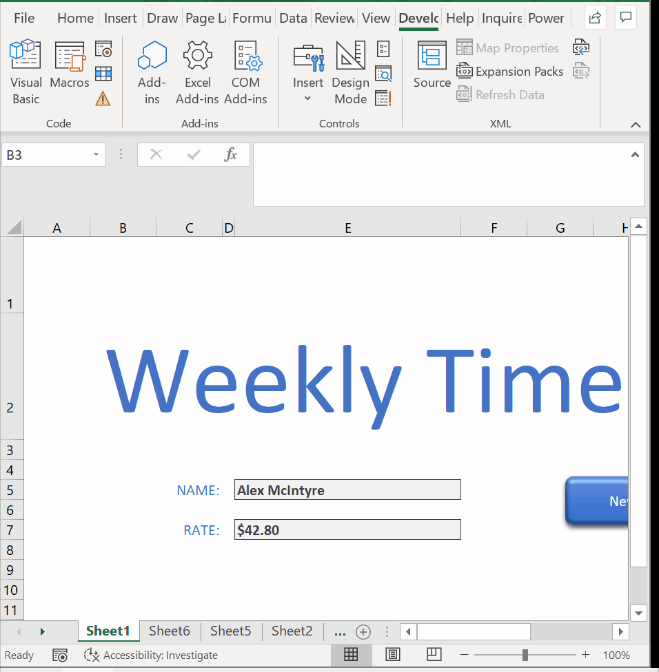
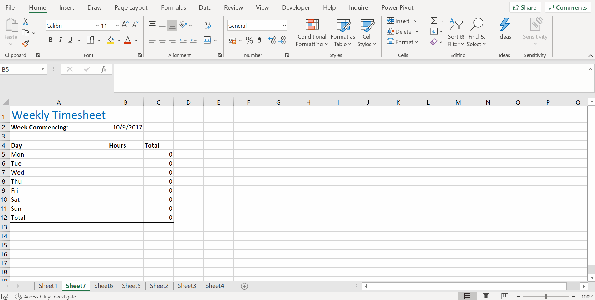

# Week 6
## Recorded Macros

**Intro**
* Macros - automate a unique procedure
* Macro - a recording of a set of actions that you would perform in Excel for a particular task
* macro is then stored and we can call upon to repeat and hence automate the action throughout our spreadsheet
* Macro - a smal program taht allows us to automate repetitive procedures in Excel

**Record a Macro**
* automate the process of generating these timesheets for them
* `Developer` ribbon
* VBA - Visual Basic for Applications
* `Developer` -> `Record Macro`

**Run a Macro**
* `Developer` -> `Insert` -> `Bottom (Form Control)`
* Right click graphical element -> `Assign Macro`

**Edit a Macro**

**Working with Macros**
* Macro Options - change the shortcut key
* `Alt + F11` - go back to code