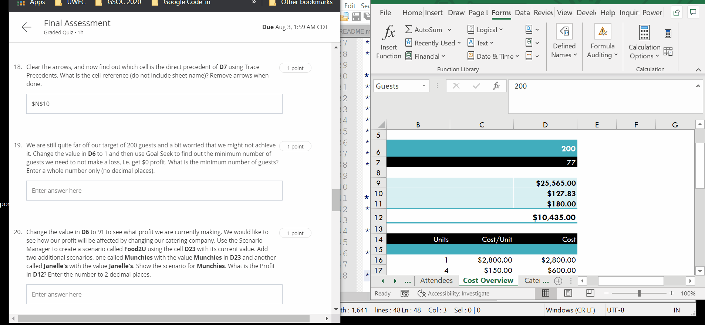
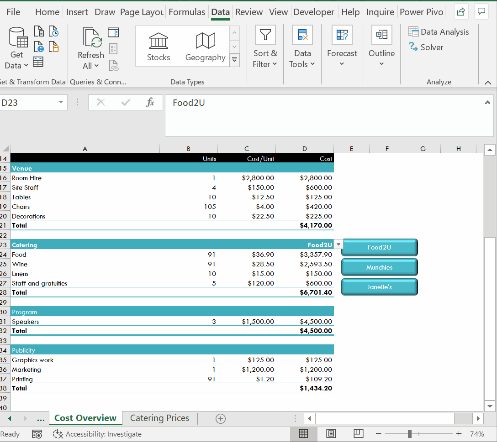

# Week 6
## Recorded Macros

**Intro**
* Macros - automate a unique procedure
* Macro - a recording of a set of actions that you would perform in Excel for a particular task
* macro is then stored and we can call upon to repeat and hence automate the action throughout our spreadsheet
* Macro - a smal program taht allows us to automate repetitive procedures in Excel

**Record a Macro**
* automate the process of generating these timesheets for them
* `Developer` ribbon
* VBA - Visual Basic for Applications
* `Developer` -> `Record Macro`

**Run a Macro**
* `Developer` -> `Insert` -> `Bottom (Form Control)`
* Right click graphical element -> `Assign Macro`

**Edit a Macro**

**Working with Macros**
* Macro Options - change the shortcut key
* `Alt + F11` - go back to code

**Relative Reference Macros**
* `Developer` -> `Use Relative References`
* `Ctrl + Down`
* Start recording macro
* `Data` _? `Legacy Wizards` -> `From Text` -> `Delimited` -> `Next` -> `Other - ;`
* `&`
* Input box
* Debug error in macro
* Why you would choose to user relative references in a macro?
	* You want to make sure that the amcro choses cells relative to a poition you chose when you recorded the macro

**Final Assessment**
* Highlight rows with Conditional Formatting: 
	* `=AND($G7="GB",$I7="New")`
* Lookup the first name for each client id 
	* `=VLOOKUP([@[Client ID]],ClientDB,2,FALSE)`
* Lookup correct seating area with the 2d array of tables
	* `=INDEX(J12:M64,MATCH([@Country],I12:$I$64,0),MATCH([@Status],$J$11:$M$11,0))`
* Goal Seek - to get profit with target number of guests

* Scenario Manager - different scenarios to see how profit will be affected by changing our catering company

